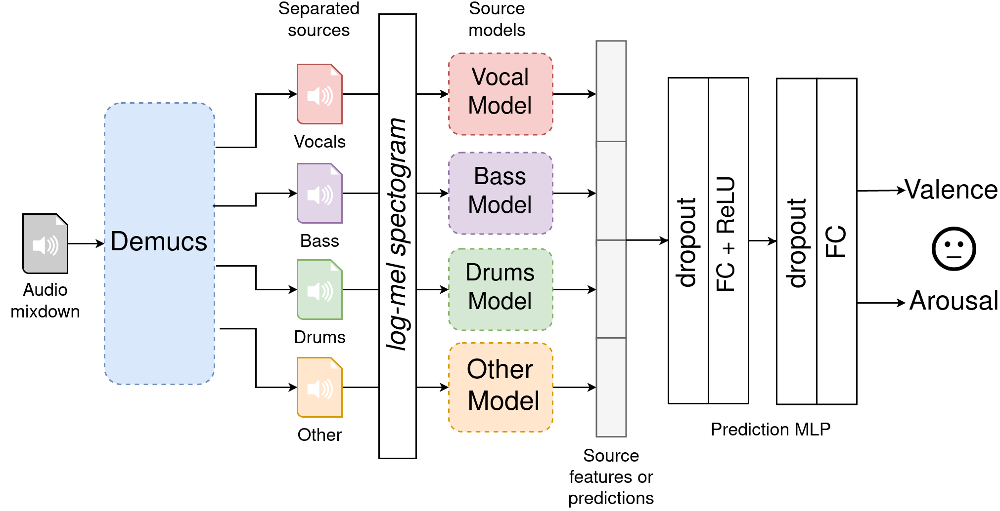
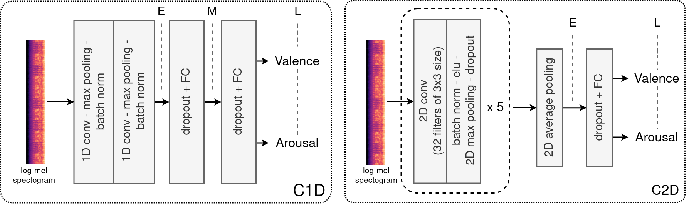

# EmoMucs
The Emotion Multiplexer (EmoMucs)

<p align="center">

</p>

This repository contains the official implementation of the paper:

*"The Multiple Voices of Musical Emotions: Source Separation for Improving Music Emotion Recognition Models and Their Interpretability"*, Jacopo de Berardinis, Angelo Cangelosi, Eduardo Coutinho. 21st International Society for Music Information Retrieval, Montreal, Canada, October 11-16, 2020. [[paper]](https://program.ismir2020.net/static/final_papers/308.pdf)[[poster]](https://program.ismir2020.net/static/posters/308.pdf)

Please, cite this paper if you use the code in this repository as part of a published research project:

```
inproceedings{deberardinis2020emomucs,
  title={The Multiple Voices of Musical Emotions: Source Separation for Improving Music Emotion Recognition Models and Their Interpretability},
  author={de Berardinis, Jacopo and Cangelosi, Angelo and Coutinho, Eduardo},
  booktitle={Proceedings of the 21st International Society for Music Information Retrieval Conference, Montreal, Canada, October 11--16, 2020},
  isbn={978-0-9813537-0-8},
  pages={310--317},
  year={2020}
}
```

This code allows reproducing the quantitative results reported in the paper. In particular, the evaluation of EmoMucs and the comparison against our baselines (Section 4.3).

Source models and baselines
===========================

<p align="center">

</p>

Requirements
============

*Coming soon!*

Training
========

*Coming soon!*


License
=======

MIT License

Copyright (c) 2020 Jacopo de Berardinis, Angelo Cangelosi, Eduardo Coutinho

Permission is hereby granted, free of charge, to any person obtaining a copy of this software and associated documentation files (the "Software"), to deal in the Software without restriction, including without limitation the rights to use, copy, modify, merge, publish, distribute, sublicense, and/or sell copies of the Software, and to permit persons to whom the Software is furnished to do so, subject to the following conditions:

The above copyright notice and this permission notice shall be included in all copies or substantial portions of the Software.

THE SOFTWARE IS PROVIDED "AS IS", WITHOUT WARRANTY OF ANY KIND, EXPRESS OR IMPLIED, INCLUDING BUT NOT LIMITED TO THE WARRANTIES OF MERCHANTABILITY, FITNESS FOR A PARTICULAR PURPOSE AND NONINFRINGEMENT. IN NO EVENT SHALL THE AUTHORS OR COPYRIGHT HOLDERS BE LIABLE FOR ANY CLAIM, DAMAGES OR OTHER LIABILITY, WHETHER IN AN ACTION OF CONTRACT, TORT OR OTHERWISE, ARISING FROM, OUT OF OR IN CONNECTION WITH THE SOFTWARE OR THE USE OR OTHER DEALINGS IN THE SOFTWARE.
